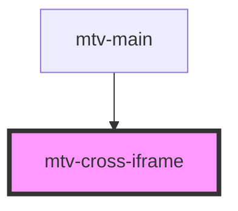

# mtv-cross-iframe

<!-- Auto Generated Below -->

## Properties

| Property        | Attribute        | Description                                                   | Type                | Default     |
| --------------- | ---------------- | ------------------------------------------------------------- | ------------------- | ----------- |
| `appRoute`      | `app-route`      | Disable loader on iframe loading;                             | `boolean`           | `false`     |
| `disableLoader` | `disable-loader` | Disable loader on iframe loading;                             | `boolean`           | `false`     |
| `fitToContent`  | `fit-to-content` | Fit size of the Element to the content of the iframe;         | `boolean \| string` | `undefined` |
| `headCode`      | `head-code`      | Head code to inject to the iframe, styles, links and scripts; | `string`            | `undefined` |
| `name`          | `name`           | The app name id.                                              | `string`            | `undefined` |
| `route`         | `route`          | The route of the gust app.                                    | `string`            | `undefined` |
| `src`           | `src`            | The url of the gust app to be hosted.                         | `string`            | `undefined` |

## Dependencies

### Used by

 - [mtv-main](../mtv-main)

### Graph

----------------------------------------------

*Built with [StencilJS](https://stenciljs.com/)*
