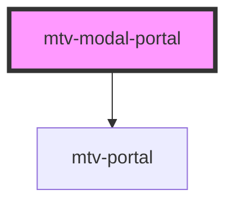

# mtv-modal-portal

<!-- Auto Generated Below -->

## Properties

| Property          | Attribute       | Description                                                                                                                              | Type          | Default                |
| ----------------- | --------------- | ---------------------------------------------------------------------------------------------------------------------------------------- | ------------- | ---------------------- |
| `hideOverlay`     | `hide-overlay`  | Hide overlay element                                                                                                                     | `boolean`     | `false`                |
| `nameId`          | `name-id`       | Id for the portal element                                                                                                                | `string`      | `undefined`            |
| `overlayColor`    | `overlay-color` | Overlay background color                                                                                                                 | `string`      | `'rgba(0, 0, 0, 0.8)'` |
| `targetContainer` | --              | Element To put the portal into. it's Can be element from current document or even element from another document like iframe parent body. | `HTMLElement` | `undefined`            |

## Events

| Event                   | Description                                                                             | Type                                                                                                                            |
| ----------------------- | --------------------------------------------------------------------------------------- | ------------------------------------------------------------------------------------------------------------------------------- |
| `elementLandedInTarget` | elementLandedInTarget event fired when the element complete to land on targetContainer. | `CustomEvent<{ portalElm: HTMLElement; portalContentElm: HTMLElement; target: HTMLElement; modalContentElm: HTMLDivElement; }>` |
| `portalLoaded`          |                                                                                         | `CustomEvent<HTMLElement>`                                                                                                      |

## Dependencies

### Depends on

- [mtv-portal](../mtv-portal)

### Graph

----------------------------------------------

*Built with [StencilJS](https://stenciljs.com/)*
