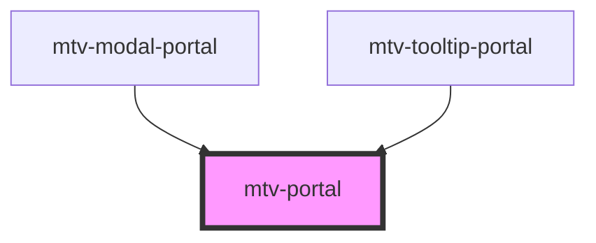

# mtv-portal

<!-- Auto Generated Below -->

## Properties

| Property          | Attribute          | Description                                                                                                                         | Type          | Default                       |
| ----------------- | ------------------ | ----------------------------------------------------------------------------------------------------------------------------------- | ------------- | ----------------------------- |
| `headInlineHtml`  | `head-inline-html` | HTML head inline code (scripts, links, styles ect...)  to inject to the targetContainer in addition to the portaled element itself; | `string`      | `undefined`                   |
| `nameId`          | `name-id`          | Uniqe name for internal classes names and ect                                                                                       | `string`      | `undefined`                   |
| `targetContainer` | --                 | The target container that will contain the portaled element.                                                                        | `HTMLElement` | `window?.top?.document?.body` |

## Events

| Event                   | Description                                                                             | Type                                                                                           |
| ----------------------- | --------------------------------------------------------------------------------------- | ---------------------------------------------------------------------------------------------- |
| `elementLandedInTarget` | elementLandedInTarget event fired when the element complete to land on targetContainer. | `CustomEvent<{ portalElm: HTMLElement; portalContentElm: HTMLElement; target: HTMLElement; }>` |
| `portalLoaded`          | portalLoaded event fired when the portal element complete to load.                      | `CustomEvent<HTMLElement>`                                                                     |

## Dependencies

### Used by

 - [mtv-modal-portal](../mtv-modal-portal)
 - [mtv-tooltip-portal](../mtv-tooltip-portal)

### Graph

----------------------------------------------

*Built with [StencilJS](https://stenciljs.com/)*
