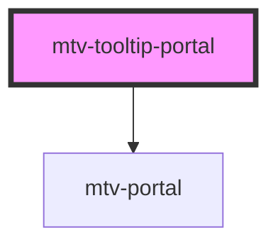

# mtv-tooltip-portal

<!-- Auto Generated Below -->

## Properties

| Property          | Attribute    | Description                                                  | Type                        | Default                       |
| ----------------- | ------------ | ------------------------------------------------------------ | --------------------------- | ----------------------------- |
| `background`      | `background` | Background color of the tooltip;                             | `string`                    | `'transparent'`               |
| `nameId`          | `name-id`    | Uniqe name for internal classes names and ect                | `string`                    | `undefined`                   |
| `position`        | --           | The Position of the portaled element.                        | `{ x: number; y: number; }` | `{ x: 0, y: 0 }`              |
| `targetContainer` | --           | The target container that will contain the portaled element. | `HTMLElement`               | `window?.top?.document?.body` |

## Events

| Event         | Description                                                                         | Type               |
| ------------- | ----------------------------------------------------------------------------------- | ------------------ |
| `tooltipBlur` | tooltipBlur event fired when tooltip element out of focus, or in shortly - blurred; | `CustomEvent<any>` |

## Dependencies

### Depends on

- [mtv-portal](../mtv-portal)

### Graph

----------------------------------------------

*Built with [StencilJS](https://stenciljs.com/)*
