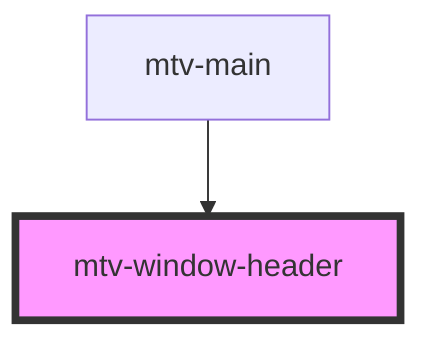

# mtv-window-header

<!-- Auto Generated Below -->

## Properties

| Property     | Attribute     | Description     | Type     | Default     |
| ------------ | ------------- | --------------- | -------- | ----------- |
| `windowName` | `window-name` | The window name | `string` | `undefined` |

## Events

| Event               | Description                              | Type                                                                                                                                     |
| ------------------- | ---------------------------------------- | ---------------------------------------------------------------------------------------------------------------------------------------- |
| `changeDisplayMode` | Emit event to change window display mode | `CustomEvent<DisplayModes.closed \| DisplayModes.dettached \| DisplayModes.fullscreen \| DisplayModes.minimized \| DisplayModes.normal>` |

## Dependencies

### Used by

 - [mtv-main](../mtv-main)

### Graph

----------------------------------------------

*Built with [StencilJS](https://stenciljs.com/)*
