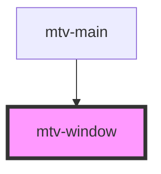

# mtv-window

<!-- Auto Generated Below -->

## Properties

| Property | Attribute | Description                                   | Type     | Default     |
| -------- | --------- | --------------------------------------------- | -------- | ----------- |
| `name`   | `name`    | Uniqe name for internal classes names and ect | `string` | `undefined` |

## Dependencies

### Used by

 - [mtv-main](../mtv-main)

### Graph

----------------------------------------------

*Built with [StencilJS](https://stenciljs.com/)*
